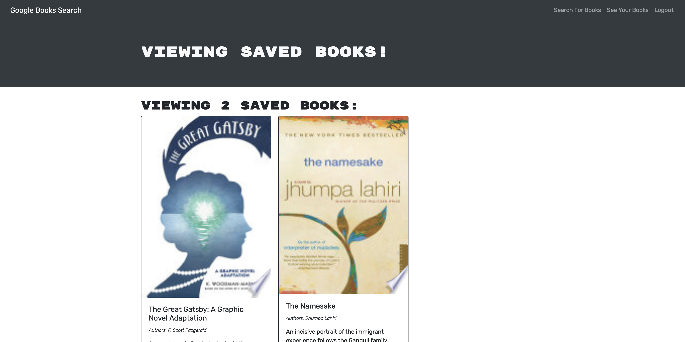

# Book Search Engine

## Description
This system allows users to search for any book against Googles publicly available API and save to their user for reference the next time they login. The application was created using a MERN stack and connected by ApolloServer and ApolloProvider node packages. After launching the application, users can signup or login. Features on the site become accessible or hidden depending on if the user is logged in or not. This is tracked using JSON web tokens. The power behind the application is thanks to the implementation of GraphQL which allows for very dynamic user queries and mutations.

## Table of Contents
* [Usage](#usage)
* [Technologies](#technologies)
* [Demo](#Demo)
* [Contributing](#contributing)
* [Questions](#questions)

## Usage

        To Start the Server: if you are running on localhost
        npm start

        
## Technologies

* [NodeJS](https://nodejs.org/en)
* [Express](https://expressjs.com/)
* [MongoDB](https://www.mongodb.com/cloud/atlas)
* [Mongoose](https://mongoosejs.com/)
* [Apollo](https://www.apollographql.com/)
* [React](https://reactjs.org/)
* [GraphQL](https://graphql.org/)
* [Google Book API](https://developers.google.com/books)

## Demo
deployed-app : [Heroku App](https://reading-book-list.herokuapp.com)

### screenshot

## Contributing

Please contribute safely

## Questions
### Where is my GitHub repository for this project?
[GitHub](https://github.com/chattean/book-search-engine)

### How to get in Contact with me if you have additional questions?

anujchatterjee@gmail.com